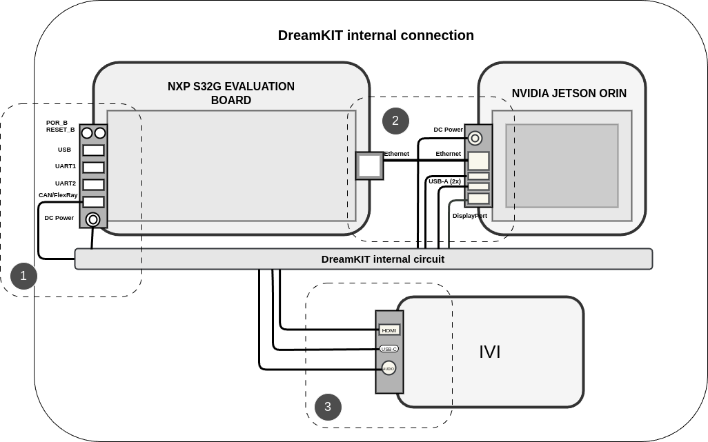
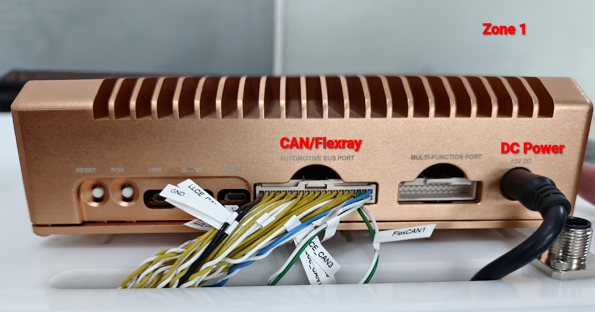
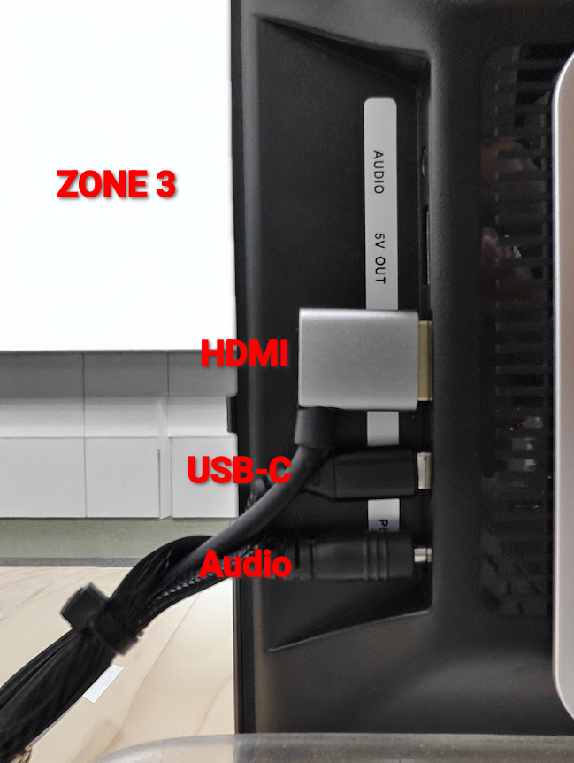

# DreamKIT Internal Connection Guide

## Hardware Connection Overview

The DreamKIT integrates three main hardware modules through a central internal circuit board, providing pre-wired connections between the NXP S32G, NVIDIA Jetson ORIN, and IVI system.

## Top-Down Real Hardware View

## Physical Hardware Layout

### Zone 1: NXP S32G Evaluation Board (Left)

**External Port Connections (Left Side)**
- **POR_B & RESET_B Buttons**: Hardware reset controls
- **USB Port**: White connector for data/debug
- **UART1 Port**: Green connector for serial communication
- **UART2 Port**: Green connector for secondary serial
- **CAN/FlexRay Port**: Blue connector for automotive protocols
- **DC Power Jack**: Black barrel connector for 12V input

**Internal Connection (Right Side)**
- **Ethernet Port**: Orange connector → Internal circuit board

### Zone 2: NVIDIA Jetson ORIN (Center-Right)

**Port Connections (Left Side)**
- **DC Power Jack**: Black barrel connector → Internal power distribution
- **Ethernet Port**: Orange connector → Internal circuit board  
- **USB-A Port (Top)**: White connector (USB 3.2 Gen 2)
- **USB-A Port (Bottom)**: White connector (USB 3.2 Gen 2)
- **DisplayPort**: Black connector for external display

### Zone 3: IVI System (Bottom)

**Port Connections (Left Side)**
- **HDMI Port**: Black connector → Internal circuit board
- **USB-C Port**: Rounded connector → Internal circuit board
- **Audio Port**: Circular connector → Internal circuit board

## Internal Hardware Connections

### Primary Data Connection
**S32G Ethernet → ORIN Ethernet**
- **Cable Type**: Internal ethernet routing via circuit board
- **Connection**: Direct point-to-point wiring
- **Bandwidth**: 1 Gbps data transfer

### Power Distribution Wiring
**Centralized Power System**
- **S32G Power Input**: 12V DC external connection
- **Internal Power Rails**: Circuit board distributes power to:
  - ORIN power input
  - IVI power input  
  - Internal circuit power

### Internal Multimedia Connections
**ORIN → IVI Hardware Links**
- **USB Connection**: Internal USB wiring from ORIN to IVI USB-C
- **Display Connection**: Internal wiring from ORIN DisplayPort to IVI HDMI
- **Audio Connection**: Internal audio signal routing to IVI audio port

## DreamKIT Internal Circuit Board

### Circuit Board Functions
**Data Routing**
- Ethernet traces: S32G ethernet port → ORIN ethernet port
- USB traces: ORIN USB → IVI USB-C  
- Display traces: ORIN DisplayPort → IVI HDMI
- Audio traces: ORIN → IVI audio port

**Power Distribution**
- 12V input from S32G power jack
- Voltage regulation circuits for each module
- Power isolation between modules
- Individual power control for each zone

## Hardware Connection Points

### External Hardware Connections Required

#### S32G External Connections
1. **12V Power Supply** → S32G DC power jack
2. **CAN Cable** → S32G CAN/FlexRay port (to vehicle systems)
3. **USB Cable** → S32G USB port (for development/debug)
4. **UART Cable** → S32G UART1/UART2 (for serial debug)

#### ORIN External Connections  
1. **Display Cable** → ORIN DisplayPort (to external monitor)
2. **USB Devices** → ORIN USB-A ports (keyboard, mouse, storage)
3. **Ethernet Cable** → ORIN Ethernet (for network access - optional)

#### IVI External Connections
1. **HDMI Cable** → IVI HDMI port (to infotainment display)
2. **USB-C Cable** → IVI USB-C (for devices/charging)
3. **Audio Cable** → IVI audio port (to speakers/headphones)

### Internal Hardware Connections (Pre-Wired)

#### S32G Internal Wiring
- **Ethernet out** → Internal circuit board ethernet traces → **ORIN ethernet in**
- **Power distribution** → Internal power rails → **ORIN & IVI power**

#### ORIN Internal Wiring  
- **Ethernet interface** → Internal traces → **S32G ethernet**
- **USB controller** → Internal USB traces → **IVI USB-C**
- **DisplayPort output** → Internal display traces → **IVI HDMI input**

#### IVI Internal Wiring
- **HDMI input** → Internal traces → **ORIN DisplayPort**
- **USB-C input** → Internal traces → **ORIN USB controller**
- **Audio input** → Internal traces → **ORIN audio output**

## Hardware Connection Sequence

### Power-On Hardware Sequence
1. **Connect external power** → S32G 12V DC jack
2. **Internal power distribution** → Circuit board powers all modules
3. **Module initialization** → Each hardware module starts up
4. **Internal link establishment** → Ethernet, USB, HDMI connections active

### Data Flow Hardware Path
1. **S32G receives** → External CAN/UART data
2. **S32G processes** → Automotive protocol handling  
3. **S32G transmits** → Via internal ethernet to ORIN
4. **ORIN processes** → AI/ML processing of received data
5. **ORIN outputs** → Via internal connections to IVI
6. **IVI displays** → Processed data on HDMI/audio outputs

## Hardware Specifications

### Internal Connection Specifications
- **Ethernet Connection**: 1000BASE-T, Cat6 equivalent traces
- **USB Connections**: USB 3.2 Gen 2, 10 Gbps traces  
- **Display Connection**: HDMI 2.1/DisplayPort 1.4 traces
- **Power Distribution**: 12V input, multiple regulated outputs (5V, 3.3V, 1.8V)

### Connector Specifications
- **Power Connectors**: 5.5mm x 2.1mm DC barrel jacks
- **Ethernet Connectors**: RJ45 8P8C
- **USB Connectors**: USB-A 3.2, USB-C 3.2
- **Display Connectors**: HDMI Type A, DisplayPort
- **Audio Connectors**: 3.5mm TRS jack

