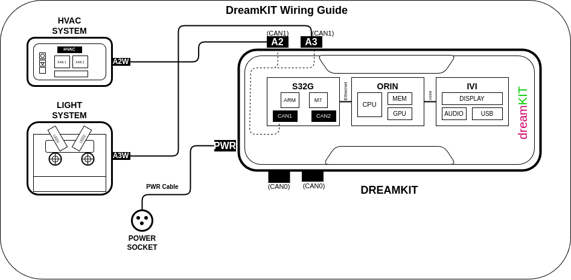

# DreamKit Connection Guide

## Simple Setup Steps

1. **Connect HVAC System A2W to DreamKit A2**
   - Use CAN cable (top path routing)
   - A2W connector on HVAC system → A2 connector on DreamKit

2. **Connect Light System A3W to DreamKit A3**
   - Use CAN cable (bottom path routing)
   - A3W connector on Light system → A3 connector on DreamKit

3. **Connect power cable to DreamKit PWR**
   - Power supply connection to PWR connector on DreamKit

## DreamKit External Connections

- **A2 (CAN1)**: HVAC control via CAN cable
- **A3 (CAN1)**: Light control via CAN cable
- **PWR**: Power supply connection

## Internal (Pre-connected)

- **USB-C**: Power and data transfer
- **USB-A (2x)**: For peripheral devices
- **HDMI**: Display output
- **Ethernet**: Network connectivity

## Connection Reference

### External Interfaces

- **A2W ↔ A2**: HVAC Control (CAN cable)
- **A3W ↔ A3**: Light Control (CAN cable)
- **PWR**: Power supply connection

### Internal Connections

- **USB-C**: Internal power/data (pre-connected)
- **USB-A (2x)**: Internal peripherals (pre-connected)
- **HDMI**: Internal display (pre-connected)
- **Ethernet**: ORIN/S32G networks (pre-connected)

## Device Specifications

### Light System
- LED Control Unit with advanced features
- Dual wheel status indicators
- CAN interface connectivity

### HVAC System
- Climate control unit
- Dual fan configuration
- CAN interface integration

### DreamKit
- ORIN processing platform
- S32G automotive gateway
- IVI infotainment system

## Internal Architecture

### Processing Modules

**ORIN Module**
- ARM CPU architecture
- Integrated GPU
- High-performance memory

**S32G Gateway**
- CAN controllers (CAN1, CAN2)
- Safety cores (ARM, M7, M4)
- Automotive communication interface

**IVI Module**
- Display control system
- Audio processing
- USB management interface

### Internal Communication

- **ORIN ↔ S32G**: PCIe connection
- **S32G ↔ IVI**: HDMI connection
- **External CAN**: A2/A3 ports connect to S32G CAN controllers
- **Rear Panel**: All internal connectors (USB-C, Ethernet, HDMI, USB-A) are pre-connected

## Additional Notes

- All internal connections come pre-configured and tested
- Follow proper cable routing for external connections
- Connect devices in the recommended sequence
- Always verify connections before powering on the system