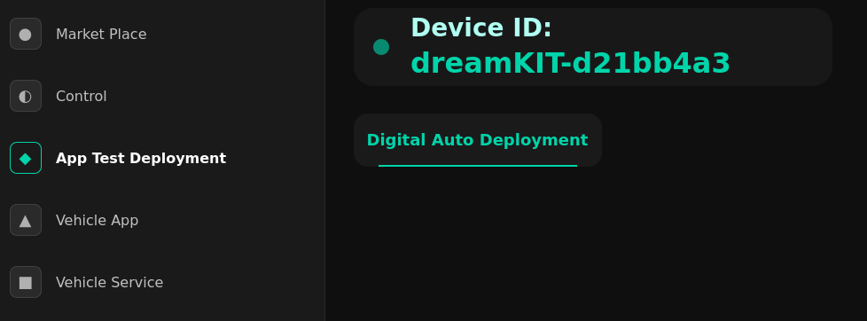

# Setup Overview
## Hardware
- DreamKIT - automotive setup
  + ComputeECU
    + Device: Jetson Orin
    + Connection: Internet, ZonalECUs (via LAN)
    + How to discover device:
```shell
# ssh connection with device via
# user: sdv-orin
# ip-add: 192.168.56.48
# interface: eth0
ssh sdv-orin@192.168.56.48
```
  + ZonalECU
    + Device: S32G Golden Box
    + Connection: ComputeECU (via LAN), Classic ECUs connectivity (via vehicle network communication (CAN, LIN, ETH))
    + How to discover device:
```shell
# ssh connection with device via
# user: root
# ip-add: 192.168.56.49
# interface: eth0
ssh root@192.168.56.49
# CAN connection via
candump can0
candump can1
```

- DreamPACK
  + Classic ECUs    --> Actuator role with sesor connectivity, vehicle network communication (CAN, LIN, ETH)


## Software

- DreamOS setup
  + dk_install.sh (installation-scripts/jetson-orin/ folder)
    + Feature: provide the possibility to install DreamOS, which includes the K3s into DreamKIT
    + Frequently usage cli to provide the flexibility for installation scenario.
```shell
sudo ./dk_install.sh -h                           # Ask for desciption
sudo ./dk_install.sh                              # Full installation with IVI enabled, zonal ECU setup
sudo ./dk_install.sh zecu=false                   # Skip zonal ECU (S32G) setup
sudo ./dk_install.sh zecu=false swupdate=true     # Software update only mode
```

    + Persitent storage: after installation, the related artifact will be saved at "~/.dk" folders
      + --> ~/.dk/sdv-runtime/vss.json  : default VSS model
      + --> ~/.dk/dk_marketplace/       : fetched data from SDV Marketplace
      + --> ~/.dk/dk_installedapps/     : artifact for installed vehicle application from SDV Marketplace (e.g,. k3s yaml file for deployment)
      + --> ~/.dk/dk_installedservices/ : artifact for installed vehicle service from SDV Marketplace (e.g,. k3s yaml file for deployment)
    + Back-up k3s yaml file
      + After installation, all related k3s yaml file will be stored at {dreamkit path}/installation-scripts/jetson-orin/tmp/dk_manifests/ folder
      + It benifits for debugging and system diagnostic if needed.

- K3s Design
  + xip: ComputeECU --> master node which local registry (name as dk_local_registry) to serve the deployment into ZonalECU, where no internet connection.
  + vip: ZonalECU   --> agent node


- DreamKIT
  + ComputeECU
    + Application:
      + DreamOS: k3s master (includes local registry), sdv-runtime, dk_ivi (known as IVI) , AI (tbd).
      + User: Vehicle Application, Vehicle Service
    + How to diagnostic the system
```shell
# General: K9s command and observation from there
k9s
# Details: k3s commands
# - Check k3s status
systemctl status k3s
# - Check node status
kubectl get nodes
kubectl describe node xip
kubectl describe node vip
```

```shell
# Get DreamKIT Id - Option 1
# --> Let's navigate to IVI, "App Test Deployment" page 
# --> From Playground, you can connection via the ID "Runtime-dreamKIT-d21bb4a3".
# --> "Runtime-" is the prefix. "d21bb4a3" is the random number for each device.
```



```shell
# Get DreamKIT Id - Option 2
# --> Let's  navigate to log of sdv-runtime container
# search keyword "RunTime display name:", result: "RunTime-DreamKIT_d21bb4a3".
kubectl logs -l app=sdv-runtime
# result
Node.js v18.5.0
2025-06-04T02:43:13.974739Z  WARN databroker: TLS is not enabled. Default behavior of accepting insecure connections when TLS is not configured may change in the future! Please use --insecure to explicitly enable this behavior.
2025-06-04T02:43:13.974778Z  WARN databroker: Authorization is not enabled.
2025-06-04T02:43:13.974863Z  INFO databroker::broker: Starting housekeeping task
2025-06-04T02:43:13.974885Z  INFO databroker::grpc::server: Listening on 0.0.0.0:55555
2025-06-04T02:43:13.974891Z  INFO databroker::grpc::server: TLS is not enabled
2025-06-04T02:43:13.974893Z  INFO databroker::grpc::server: Authorization is not enabled.
INFO:mock_service:Initialization ...
INFO:mock_service:Connecting to Data Broker [127.0.0.1:55555]
INFO:kuksa_client.grpc:No Root CA present, it will not be possible to use a secure connection!
INFO:kuksa_client.grpc:Establishing insecure channel
INFO:mock_service:Databroker connected!
INFO:mock_service:Subscribing to 0 mocked datapoints...
RunTime display name: RunTime-DreamKIT_d21bb4a3
Connecting to Kit Server: https://kit.digitalauto.tech
Kuksa connected True
Connected to Kit Server 
sdv-orin@ubuntu:~$ 
```


  + ZonalECU
    + Device: S32G Golden Box
    + Connection: ComputeECU (via LAN), Classic ECUs connectivity (via vehicle network communication (CAN, LIN, ETH))
    + Application:
      + DreamOS: K3s setup for agent node
      + User: Vehicle Service, like Kuksa CAN Provider.
    + How to diagnostic the system
```shell
# Observation k3s master local registry
curl -v http://192.168.56.48:5000/v2/_catalog
# Result with docker image list
# --> rancher/mirrored-pause: for k3s agent
# --> eclipse-autowrx/dk_service_can_provider: example image for kuksa can provider
*   Trying 192.168.56.48:5000...
* Connected to 192.168.56.48 (192.168.56.48) port 5000 (#0)
> GET /v2/_catalog HTTP/1.1
> Host: 192.168.56.48:5000
> User-Agent: curl/7.88.1
> Accept: */*
> 
< HTTP/1.1 200 OK
< Content-Type: application/json; charset=utf-8
< Docker-Distribution-Api-Version: registry/2.0
< X-Content-Type-Options: nosniff
< Date: Wed, 10 Sep 2025 07:10:54 GMT
< Content-Length: 261
< 
{"repositories":["eclipse-autowrx/dk_service_can_provider","rancher/mirrored-pause"]}
* Connection #0 to host 192.168.56.48 left intact
```

- DreamPACK
  + Classic ECUs    --> Actuator role with sesor connectivity, vehicle network communication (CAN, LIN, ETH)

## World

### QM App Testing
- Playground
  + url: https://playground.digital.auto/
  + purpose:
    + Build & Deploy the desired VSS Model into DreamKIT
    + Deploy the QM App into dedicated DreamKIT device, which is the automotive setup.
- DreamKIT
  + ComputeECU
    + connection:
      + 'sdv-runtime' docker container : publish the DreamKIT Id to the world. then Playground can discover and establish connection via that Id.
    + purpose:
      + to host the kuksa-databroker (port 55555:55555) for VSS Model and connectivity of related vehical applications & vehical services
      + to provide nesseacry environment for QM APP running

### SDV Marketplace
- SDV Marketplace
  + url: https://marketplace.digitalauto.tech/
  + purpose: introduce the {vehical applications & vehical services} to the world
  + template Structure (for IVI understanding):
```shell
{
  "Target": "xip",                    // 🎯 Deployment target node. "{xip - ComputeECU}, {vip - ZonalECU}"
  "Platform": "linux/arm64",          // 🏗️ Hardware architecture
  "DockerImageURL": "docker.io/nginx:alpine",  // 📦 Container image
  "RuntimeCfg": {                     // ⚙️ Runtime configuration
    "hostDev": true,                  // 🔌 Hardware device access
    "DISPLAY": ":0",                  // 🖥️ Display connection
    "volumes": [{                     // 💾 Storage mappings
      "hostPath": "/opt/web-content",
      "mountPath": "/usr/share/nginx/html",
      "readOnly": false
    }]
  }
}
```

- DreamKIT
  + ComputeECU
    + connection:
      + IVI : fetch information from SDV Marketplace and pop out available services for user's DreamKIT device.
    + purpose:
      + to install - deploy the {vehical applications (xip) & vehical services (xip/vip) }

