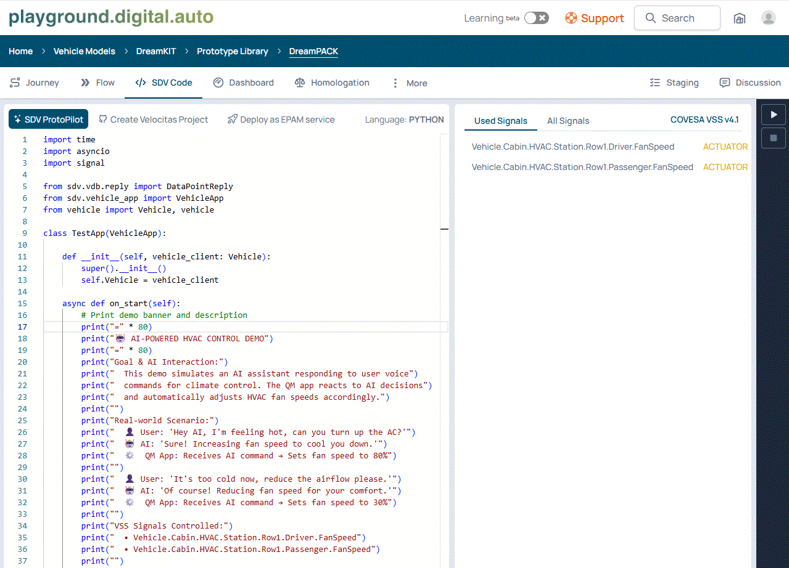
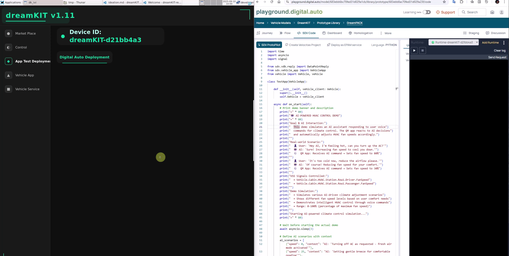

# Goal
Define your demo secnario
What's kind of service that introduce to user's experience
For example with HVAC, where it can befinit for air condition control, etc.
Here's the updated code with AI interaction goal and description:

## Key AI Interaction Features:

## **Goal Statement:**
- **Primary Goal**: Demonstrate AI-powered climate control where users can naturally request HVAC adjustments through voice commands, and the QM app intelligently responds by setting appropriate fan speeds.

### **AI Interaction Flow:**
1. **User Voice Input** → AI processes natural language
2. **AI Decision Making** → Determines optimal fan speed
3. **QM App Execution** → Translates AI commands to VSS signals
4. **Vehicle Response** → HVAC system adjusts accordingly

### **Realistic Scenarios Simulated:**
- **Comfort Requests**: "I'm too hot/cold"
- **Activity-based**: "Set gentle breeze for reading"
- **Weather-aware**: "It's hot outside, cool the cabin"
- **Automatic Adjustments**: "Target temperature reached"

### **Example Output:**
```
🎤 User Request Detected...
🤖 AI: 'Increasing airflow - detected warm weather outside'
⚙️  QM App: Executing AI command → Fan Speed: 75% (ACTIVE)
✅ Climate adjustment complete!
```

This demo showcases how AI can bridge the gap between natural user requests and precise vehicle control through VSS signals, making climate control more intuitive and responsive to user needs.

# Design
## Connectivity
Driver / Passenger can able to increase/ decrease fan speed
VSS
- Vehicle.Cabin.HVAC.Station.Row1.Driver.FanSpeed     --> driver side.
- Vehicle.Cabin.HVAC.Station.Row1.Passenger.FanSpeed  --> passenger side.
CAN message/ signale
- VCRIGHT_hvacBlowerSpeedRPMReq
- VCLEFT_hvacBlowerRPMTarget

dbc_overlay.vspec
```shell
Vehicle.Cabin.HVAC.Station.Row1.Driver.FanSpeed:
  datatype: int8
  type: actuator
  vss2dbc:
    signal: VCRIGHT_hvacBlowerSpeedRPMReq

Vehicle.Cabin.HVAC.Station.Row1.Passenger.FanSpeed:
  datatype: int8
  type: actuator
  vss2dbc:
    signal: VCLEFT_hvacBlowerRPMTarget
```

## Vehicle Application
User define.
For example, the one that you build in Playground and wanna to deploy into DreamKIT for testing



## Vehicle Service

### IVI
Goal to provide the user interface to able interact with vehicle

For example with 'Vehicle.Cabin.HVAC.Station.Row1.Driver.FanSpeed' VSS
- Driver side can adjust the value from 0-100%

Example software: dk-ivi-lite
- UI and Logic handling: dreamos-core/dk-ivi-lite/src/controls/
- Interface to vehicle-api
  + Library: dreamos-core/dk-ivi-lite/src/library/target/{platform}/libKuksaClient.so
  + Interface: dreamos-core/dk-ivi-lite/src/platform/integrations/vehicle-api/


### Kuksa CAN Provider
Goal to enable connection between vehical signal (CAN) to vehical services

Example software: dreampack-HVAC-CAN-provider
- VSS
  + Design: 
    + dbc_overlay.vspec (services/dreampack-HVAC-CAN-provider/prepare-dbc-file/mapping/vss_4.0/ folder) --> design the mapping, signal type, etc.
  + Output
    + vss_dbc.json (services/dreampack-HVAC-CAN-provider/prepare-dbc-file/mapping/vss_4.0/ folder)      --> mapping between VSS <-> CAN signals
    + dbc_default_values.json (services/dreampack-HVAC-CAN-provider/prepare-dbc-file/mapping/ folder)   --> for the default value of related CAN signals. Required for vss actuator type only.
- CAN DBC
  + ModelCAN.dbc (services/dreampack-HVAC-CAN-provider/prepare-dbc-file/ folder)
    + Design your network
    + Signal compute method / raw value (optional)

Detail information, you can refer to the https://github.com/eclipse-kuksa/kuksa-can-provider

### Publish Vehicle Application/Service into Marketplace
The Marketplace is centralized area for all public services, which can benifit for Car user's experience

At DreamKIT, IVI is area for user to fetch the latest services and intall-deploy into their car.

Let's navigate to https://marketplace.digitalauto.tech/
Example for HVAC - DreamPACK
```shell
{
   "Target": "vip",
   "Platform": "linux/arm64",
   "DockerImageURL": "ghcr.io/eclipse-autowrx/dk_service_can_provider:latest",
   "RuntimeCfg": {
    "CAN_PORT": "can1",
    "MAPPING_FILE": "mapping/vss_4.0/vss_dbc.json",
    "KUKSA_ADDRESS": "192.168.56.48"
   }
}
```

## Actuator (DreamPACK)
Goal to observe the request via dedicated CAN signals and react based on the design.
For example with VCRIGHT_hvacBlowerSpeedRPMReq
- if receive value 10: set related PWM channel to 10% to launch the driver fan motor


# Deployment and Testing

Playground <-> DreamKIT
- From the Playground, you have to deploy the latest VSS model into DreamKIT. The deployment required 1 time only. After that, the you can enjoy with your desired vehicle app or vehicle services
- At DreamKIT, IVI, "App Test Deployment" pages you make see you device id, like: dreamKIT-{8 random numbers}. (for example: dreamKIT-d21bb4a3)
- At Playground (https://playground.digital.auto/model/683ebb6bc70fed31d029a1cb/library/prototype/683ebb8ac70fed31d029a23f/dashboard)
  + AddRuntime: Runtime-dreamKIT-d21bb4a3. "Runtime-" is the prefix.
  + SendRequest > "Rebuild Vehicle Modle base on current Vehicle API"




- Result
  + The desired VSS model will be deployed into your DreamKIT machine via sdv-runtime application
  + sdv-runtime application
    + invoke the kuksa-databroker, which is local host on port 55555:55555
    + the application was deployed via k3s yaml file with "hostNetwork: true" option. therefore, it's possible to serve all request related to vss.

At DreamKIT, IVI
- Installation
  + Navigate to Vehicle App/ Vehicle Service sub-pages to search and install your desired one.
  + images:

- Launch the services
  + Navigate to Vehicle App/ Vehicle Service pages to enable to services
  + images:


