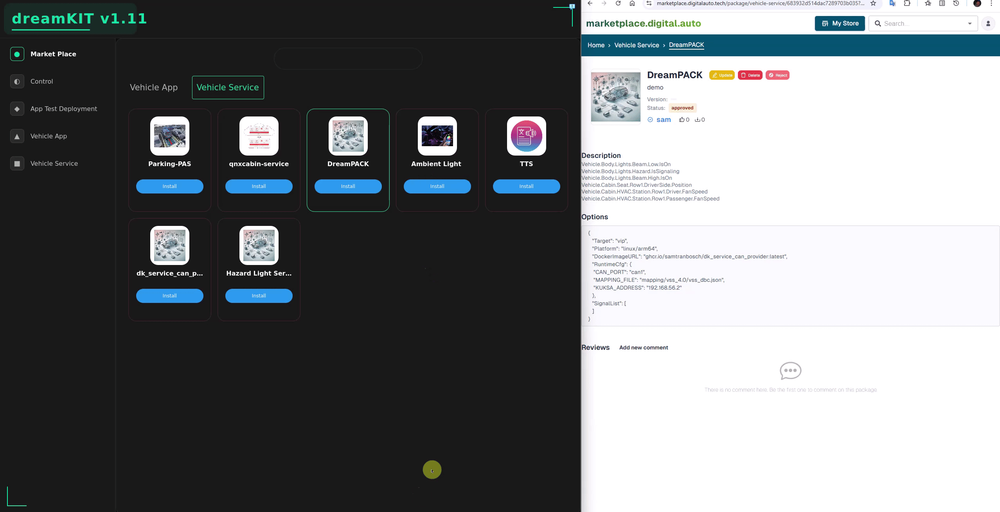

# Goal
Install App/Service from marketplace

# Workflow
- OEM public the App/Service into marketplace
  + url: https://marketplace.digitalauto.tech/
  + purpose: introduce the {vehical applications & vehical services} to the world
  + template Structure (for IVI understanding):
```shell
{
  "Target": "xip",                    // 🎯 Deployment target node. "{xip - ComputeECU}, {vip - ZonalECU}"
  "Platform": "linux/arm64",          // 🏗️ Hardware architecture
  "DockerImageURL": "docker.io/nginx:alpine",  // 📦 Container image
  "RuntimeCfg": {                     // ⚙️ Runtime configuration
    "hostDev": true,                  // 🔌 Hardware device access
    "DISPLAY": ":0",                  // 🖥️ Display connection
    "volumes": [{                     // 💾 Storage mappings
      "hostPath": "/opt/web-content",
      "mountPath": "/usr/share/nginx/html",
      "readOnly": false
    }]
  }
}
```


# Vehicle Application
- DreamKIT
  + ComputeECU
    + connection:
      + IVI : fetch information from SDV Marketplace and pop out available services for user's DreamKIT device.
    + purpose:
      + to install > start the vehicle application based on the pre-define device. It ussually "xip" - ComputeECU


# Vehicle Service

- DreamKIT
  + ComputeECU
    + connection:
      + IVI : fetch information from SDV Marketplace and pop out available services for user's DreamKIT device.
    + purpose:
      + to install > start the vehicle application based on the pre-define device. It can be the "xip" - ComputeECU or "vip" - ZonalECU
Following is example
  + name: dreampack-HVAC-CAN-provider
  + device: "vip" - ZonalECU
  + installation


    + debugging


